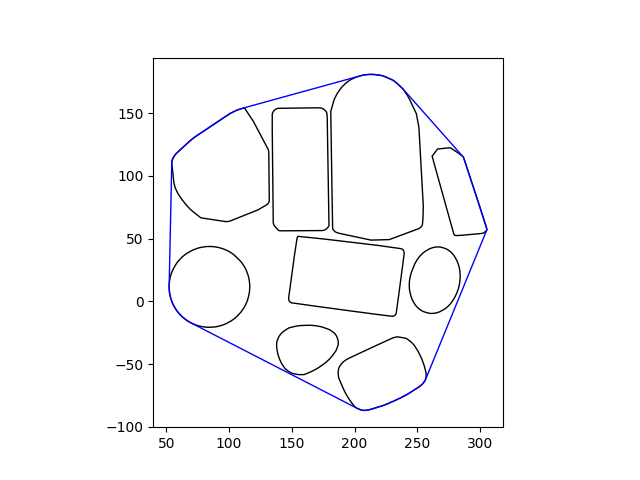
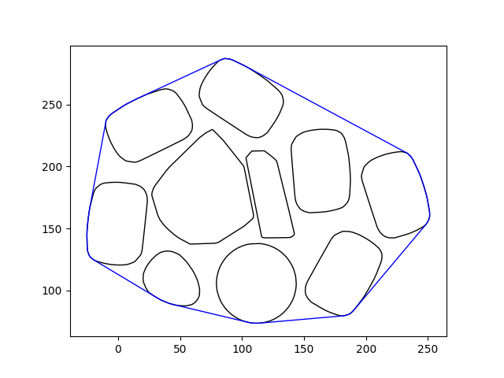
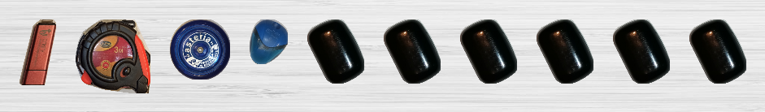
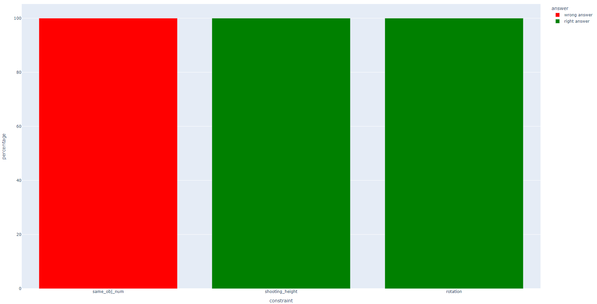
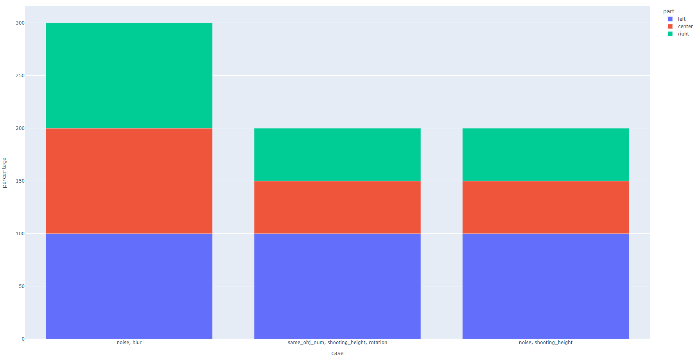

# Схема работы

## tester.py

Файл с классом чекера.

### Алгоритм генерации многоугольника

Алгоритм генерации такого многоугольника для заданного множества объектов, что объекты можно упаковать в построенный многоугольник без пересечений. В алгоритме используются выпуклые оболочки контуров предметов. 

0. Инициализируется итоговый многоугольник первым многоугольником из заданного множества.
1. Рассматривается первый из оставшихся многоугольников. У него находится наибольшая по длине сторона.
2. Находится наибольшая по длине сторона в итоговом многоугольнике.
3. Рассматриваемый многоугольник поворачивается и перемещается так, чтобы центры его наибольшей по длине стороны и наибольшей по длине стороны итогового многоугольника совпали. При этом их наибольшие по длине стороны должны лежать на одной прямой, которая будет являться разделяющей для этих двух многоугольников.
4. Рассматриваемый многоугольник немного отодвигается от итогового в направлении от центра итогового многоугольника к центру рассматриваемого многоугольника.
5. Итоговым многоугольником становится выпуклая оболочка для точек итогового и рассматриваемого многоугольников.
6. Если в заданном множестве остались нерассмотренные многоугольники, то возвращаемся на шаг 1. В противном случае многоугольник построен.

#### Примеры

### Алгоритм генерации изображения

Алгоритм генерации изображения с предметами из заданного множества для intelligent placer.

1. Для каждого объекта строится изображение с этим объектом так, чтобы фон был прозрачным, а границами изображения был описывающий прямоугольник для контура объекта.
2. Если указана высота съёмки и она не равна высоте по умолчанию, то высчитывается коэффициент масштаба, который применяется ко всем изображениям предметов.
3. Если указан угол для поворота предметов, то все изображения предметов поворачиваются на соответсвующий угол.
4. Учитывая настройку для минимального расстояния между предметами, все изображения предметов склеиваются в одну полоску, к которой добавляется фон.
5. Если указано, что нужно добавить шум, то к итоговому изображению добавляется шум.
6. Если указано, что нужно добавить размытие, то итоговое изображение размывается.
7. Изображение готово.

#### Примеры

### Алгоритм тестирования

Алгоритм проверки правильной работы intelligent placer. Алгоритм состоит из двух этапов.

- Первый этап
  
  Выполняется для каждого ограничения из списка: same_obj_num, shooting_height, rotation, noise, blur. Для каждого из этих ограничений в файле конфигурации задан отрезок, на котором intelligent placer должен работать корректно. На первом этапе каждый отрезок делится максимум на 3 части: где intelligent placer работает корректно, где intelligent placer не проверялся и где intelligent placer работает некорректно. Для построения данного разбиения используется гипотеза о том, что в "левой" точке отрезка из конфигурационного файла intelligent placer не должен выдавать неверный ответ, а в "правой" точке данного отрезка он может ошибиться. При этом где-то на отрезке, если в "правой" точке был выдан неверный ответ, находится точка, до которой intelligent placer всегда отвечает верно, а после неё - всегда ошибается. Данная точка находится бинарным поиском и представляет собой отрезок, длиной не меньше 1% от длины отрезка из конфигурационного файла. При этом отрезок может быть не разделён на 3 части:
  * если intelligent placer ошибся в "левой" точке, то по гипотезе, он ошибётся и на всём отрезке
  * если intelligent placer не ошибся в "правой" точке, то по гипотезе, он не ошибётся и на всём отрезке

- Второй этап

  Выполняется для каждого набора ограничений из списка:
  * noise, blur
  * same_obj_num, shooting_height, rotation
  * noise, shooting_height
  
  Для каждого набора ограничений рассматривается 7 точек на основе разделения отрезков из конфигурационного файла на 3 части. Для каждой точки генерируется одно изображение и два теста:
  * тест с упаковкой в многоугольник, на который intelligent placer должен выдать ответ `True`
  * тест с упаковкой в прямоугольник, на который intelligent placer должен выдать ответ `False`
  
  7 точек разделяется на 3 группы:
  * 2 точки: "левая" граница отрезка и середина между "левой" границей отрезка и "левой" границей центральной части отрезка.
    Здесь 4 теста.
  * 3 точки: "левая" и "правая" границы центральной части отрезка и середина между ними.
    Здесь 6 тестов.
  * 2 точки: "правая" граница отрезка и середина между "правой" границей отрезка и "правой" границей центральной части отрезка.
    Здесь 4 теста.

  Для каждой группы считается процент верных ответов intelligent placer в ней.

#### Примеры

